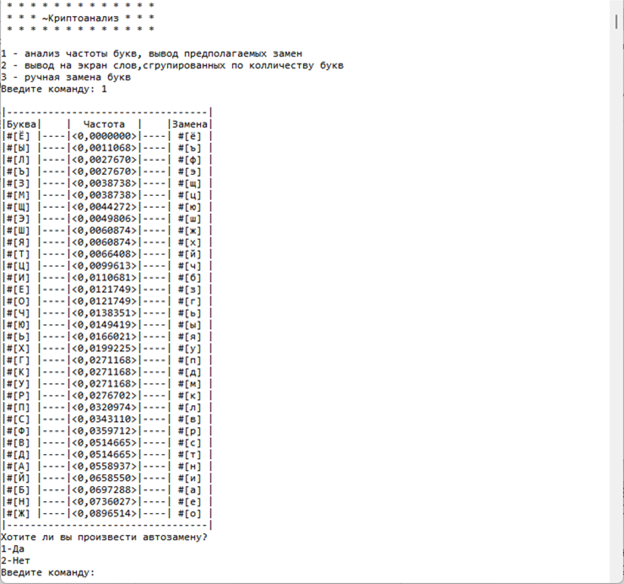
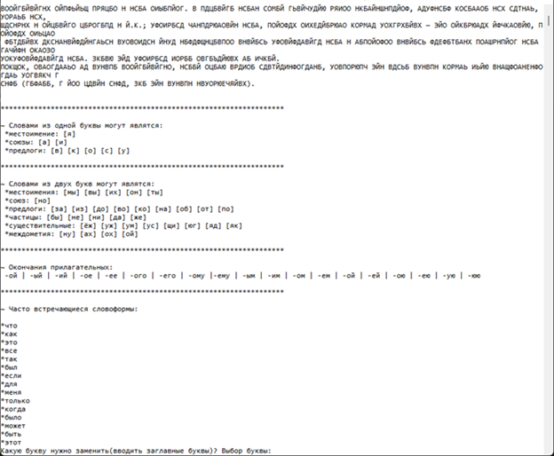

# encrypted-text-cryptanalysis
Консольная программа для дешифровки текста, зашифрованного с помощью подстановочного шифра (пример такого текста находится в файле test.txt).

Функции программы:
1 Анализ частоты букв в зашифрованном тексте
2 Автозамена на основе частотного анализа
3 Вывод на экран слов, сгруппированных по количеству букв
4 Выполнение ручной замены по 1 букве
4 Отмена последней замены
5 Вывод на экран слов, сгрупированных по колличеству расшифрованных букв
6 Отображение криптограммы и расшифрованного на данный момент текста построчно

Примеры работы с интерфейсом программы представлены на рисунках:

